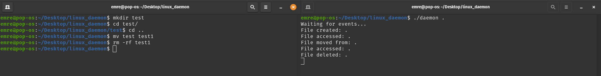

# Linux daemon

Linux daemon using [inotify](https://man7.org/linux/man-pages/man7/inotify.7.html) API. Inotify is used to monitor individual files, or to monitor directories.

# Usage

1) Compile daemon.c:

        g++ daemon.c -o daemon

2) Replace "test" with the Folder/File you want to run the daemon on:

        ./daemon test
